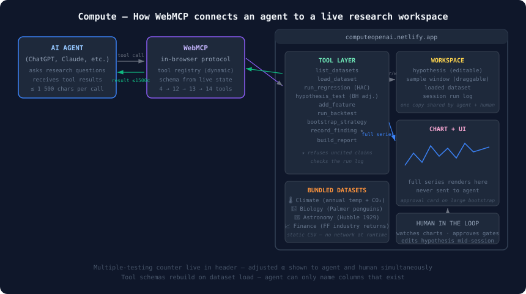

# Compute

**A research bench where you can check the agent's work.**

Try it: **[computeopenai.netlify.app](https://computeopenai.netlify.app)**

---

The problem with letting an agent run your analysis is that you can't check it afterwards. The numbers show up with no record of how they were produced, no account of all the things that were tried before one of them worked, and no way to reproduce any of it. That gets worse the faster the models get.

Compute is an attempt to fix that by construction rather than by discipline. It's a static page — no backend, no API key — that exposes a full statistical toolkit to an AI agent through [WebMCP](https://github.com/webmachinelearning/webmcp). Every tool call is logged. Findings have to cite the step that produced them. The significance threshold tightens in real time as the session accumulates tests, and the agent sees that adjustment in the tool result, not just the human watching the screen.



---

## Why this is a WebMCP project and not a headless server

The obvious question about any WebMCP submission is: *why can't this just be a normal MCP server?* A tool that runs a regression over a bundled CSV doesn't need a browser.

Compute is built so that every tool is inseparable from the page. Five things that only work in-page:

**1. The tool surface is generated from live page state**

When a dataset loads, Compute tears down the analysis tools and registers them again with that dataset's actual column names baked into the `enum` of their `inputSchema`. Add a derived column and the enums grow to include it — immediately, with nothing told to the agent.

You can watch it happen in the header: the tool count goes **4 → 12** when a dataset loads, **→ 13** when a signal column is created, **→ 14** after a backtest is registered.

| State | Tools |
|---|---|
| Nothing loaded | `list_datasets` `get_state` `load_dataset` `set_hypothesis` |
| Dataset loaded | `+ describe_dataset` `add_feature` `summary_stats` `correlate` `run_regression` `hypothesis_test` `record_finding` `build_report` |
| Causal signal exists | `+ run_backtest` |
| Backtest exists | `+ bootstrap_strategy` |

A static MCP manifest — fixed at connect time, before anyone knows which dataset is loaded — can't do this.

**2. Split results: numbers to the agent, chart to the screen**

A tool call returns at most 1,500 characters — coefficients, t-stats, a verdict. The same call pushes the full series into the workspace store and the chart redraws. One call, two audiences, and the large object never crosses the boundary to the model.

**3. Shared mutable state**

There's one `workspace` object. When the human drags the sample window, the agent's next tool call reads the new window. No second copy, no sync protocol. Both are operating one instrument.

**4. Human-in-the-loop gates**

A bootstrap above 2,000 simulations renders an approval card and the tool call awaits a click before proceeding. From the agent's side the call just takes longer.

**5. Provenance**

Every tool call is appended to a run log with its arguments, a result digest and a timestamp. `record_finding` refuses a claim that doesn't cite a step that actually ran — which makes fabrication structurally awkward rather than merely discouraged.

---

## The multiple-testing problem

An agent can test five hundred hypotheses a minute. Nothing in the current research stack keeps score of that.

Compute counts every hypothesis tested in the session and shows the multiple-comparison-adjusted threshold live in the header:

```
TESTED  7     ADJUSTED ALPHA  0.00714
● Latest result is not significant once adjusted
```

`run_regression` and `hypothesis_test` return this block in their payload, so the agent has to confront it in its own reasoning, not just the human reading the screen. A regression registers *every* slope as a test — reporting the best of five coefficients as a single test is exactly the behaviour the counter exists to make visible.

---

## Getting started

```bash
npm install
npm run dev   # http://localhost:5180
```

Add `?dev=1` to the URL for the developer console — lists every registered tool with its live schema and lets you run tool calls by hand with JSON arguments. No agent required. The tool list rebuilds itself as the workspace changes, which is the clearest way to watch the reactive registry work.

```bash
npm test          # 166 tests
npm run build     # typecheck + production build
```

## Connecting an agent

WebMCP needs a browser that supports it and a secure context (`localhost` counts).

**ChatGPT's in-app browser** supports WebMCP. Paste `https://computeopenai.netlify.app/` into a chat and ask a plain-language research question — don't name a tool:

- *"Is there a momentum effect in US industry returns?"*
- *"Do Adelie and Gentoo penguins differ in body mass?"*
- *"How much of global temperature variation is explained by CO₂?"*

The header chip turns green and the capability count starts moving when the agent connects.

**Chrome 149+** — open `chrome://flags`, search `webmcp`, enable it and restart.

The page shows `not attached` if no host is present, and the capability count still describes what the page offers — so it's easy to tell whether the agent is actually running tools or just talking about it.

## What the analysis shows

As soon as a question is asked, the page runs an automatic analysis pipeline and generates a full report — no extra tool calls needed from the agent.

**Industry momentum (2015–2025):**  
Ask *"Does industry momentum survive out of sample and transaction costs?"* The app creates a 252-day momentum signal, runs a 70/30 train/test backtest with transaction costs, and fits a three-factor regression. On the 2015–2025 sample, momentum **degrades out of sample** — strong in-sample Sharpe, much weaker in the holdout period, largely because of the 2020 COVID momentum crash and the 2022 value/momentum reversal. The regression confirms high market beta (~0.95) and positive SMB/HML loadings.

**Penguin species (body mass):**  
Ask *"Do Adelie and Gentoo penguins differ in body mass?"* The app runs an ANOVA across species, then fits a regression of body mass on flipper length and bill dimensions. The groups differ significantly — the p-value survives the session-adjusted Bonferroni threshold.

**Climate:**  
Ask *"How much of global warming is explained by CO₂?"* The regression of temperature anomaly on CO₂ concentration explains roughly 90% of the variance (R² ≈ 0.90).

**Hubble 1929:**  
Ask *"Recover Hubble's constant from his original data."* The regression slope gives ~450 km/s/Mpc — Hubble's original estimate, roughly 6× the modern value due to distance calibration errors in Cepheid variable stars.

## Deploying

Static bundle, no backend. Anything that serves files works.

**Netlify/Vercel/Cloudflare Pages** — connect the repo and accept the detected settings. `netlify.toml` is already correct (`npm run build`, publish `dist`).

**GitHub Pages** — `.github/workflows/deploy.yml` typechecks, tests and publishes on every push to `main`. Enable under Settings → Pages → Source: GitHub Actions.

If the app lives at a subpath rather than the domain root, set `DEPLOY_BASE`:

```bash
DEPLOY_BASE=/Compute-OpenAiMCP/ npm run build
```

---

## Architecture

```
  ChatGPT / Chrome agent
          │  document.modelContext  (tool call)
          ▼
  ┌──────────────────────────────────────────────┐
  │  Compute page — static, no server            │
  │                                              │
  │   webmcp/registry.ts ──► workspace store     │
  │        │  (reactive)         (Zustand)       │
  │        │                       │             │
  │        │                       ├─► React UI  │
  │        ▼                       │   charts,   │
  │   webmcp/tools/*.ts            │   run log   │
  │        │                                     │
  │        └─► engine/*.ts                       │
  │            OLS · HAC · distributions ·       │
  │            features · backtest · bootstrap   │
  └──────────────────────────────────────────────┘
                     │
           bundled CSVs in /public/data
```

Zustand rather than React context because WebMCP tool functions are plain non-React code that need to read and mutate state from outside the component tree, and `useWorkspace.getState()` does that in one line.

### Layout

```
src/
  config.ts               app config, dataset manifest, thresholds
  state/workspace.ts      single source of truth
  state/runlog.ts         provenance log
  webmcp/
    host.ts               entry-point shim + AbortSignal teardown
    result.ts             result/error adapters, 1500-char cap
    registry.ts           reactive register/unregister, serialized
    availability.ts       which tools exist right now
    schemas.ts            schema builders bound to live columns
    tools/                session · features · analysis · strategy · report
  engine/
    matrix.ts             Householder QR, Cholesky, collinearity check
    dist.ts               t, F, chi², normal CDFs
    ols.ts                OLS + Newey-West HAC standard errors
    stats.ts              moments, ACF, correlation, drawdown
    features.ts           causal transforms (one labelled non-causal)
    backtest.ts           cross-sectional long/short, no look-ahead
    bootstrap.ts          stationary block bootstrap
    multipletests.ts      session counter, Bonferroni, Benjamini-Hochberg
    frame.ts, loader.ts   table model and CSV parsing
  ui/                     Brief · WorkspacePanel · ApprovalCard ·
                          ActivityLog · AgentStatus · Chart · DevConsole
```

---

## Testing

`npm test` runs 166 tests. Numerical results are checked against fixtures generated by SciPy and NumPy ([`scripts/make_fixtures.py`](scripts/make_fixtures.py)) and committed as JSON — nothing here is a value the TypeScript produced and then blessed as correct.

- **Distributions** match `scipy.stats` to 1e-11 relative.
- **OLS** is verified against `numpy.linalg.lstsq` (LAPACK SVD) — a different algorithm from the Householder QR under test.
- **Newey-West** is verified to produce larger standard errors than classical ones under AR(1) errors of 0.85.
- **Causality** is a property test: every causal transform must be bit-identical on a truncated frame. `forward_return` is asserted to *fail* that test.
- **Look-ahead** in the backtester: a signal equal to tomorrow's return must produce Sharpe > 8; a signal equal to today's return must produce roughly nothing (< 2).
- **The WebMCP registry** is tested against a mock host: duplicate names reject, teardown happens via AbortSignal, concurrent syncs serialize.
- **End-to-end** through the real tool surface, against the real CSVs, including adversarial calls — misspelled columns, wrong types, calls out of order.

---

## Data

Five datasets across four fields, all committed as static files — no API key, no rate limit.

| File | Field | Source |
|---|---|---|
| `climate_annual.csv` | climate | NOAA GCAG, NASA GISTEMP, NOAA GML |
| `penguins.csv` | biology | Horst, Hill & Gorman (2020), CC0 |
| `hubble_1929.csv` | astronomy | Hubble (1929), *PNAS* 15(3):168–173 |
| `industries_daily.csv` | finance | Kenneth R. French Data Library |
| `ff_factors_daily.csv` | finance | Kenneth R. French Data Library |

Full provenance and licence details in [`public/data/SOURCES.md`](public/data/SOURCES.md). Regenerate with `python scripts/fetch_data.py`.

**Drop a CSV onto the page** and it becomes the workspace — parsed in the browser, never uploaded. The schema is inferred from the content and the tool enums rebuild around whatever columns you brought.

---

## Notes on the WebMCP spec

The spec moved a few times in early 2026. Per the current `index.bs` on `main`:

- The entry point is **`document.modelContext`** (moved from `navigator.modelContext` in May 2026).
- **There is no `unregisterTool`** — removed April 2026 in favour of `AbortSignal`.
- Registering a name that already exists **rejects** rather than replacing it.

`src/webmcp/host.ts` handles both spellings and falls back to `unregisterTool` for polyfills that still ship it.

---

## Licence

MIT. See [LICENSE](LICENSE).
